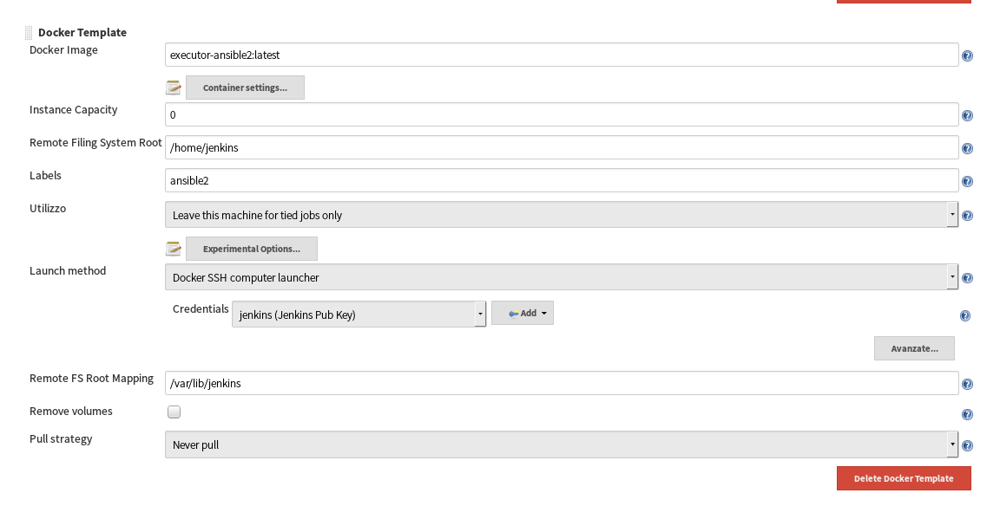

# Docker Executors

Here you can find dockerfile used to create container used by Jenkins as Slave to run its job.

## Executors Available

### executor-base
This is the base container to allow Jenkins to use it as executore.
Before you use please:
- Put in *file/authorized_keys* the SSH public Key of jenkins user. SSH is the method used by jenkins to access to container.
- Put in the Dockerfile the uid and gid of Jenkins Host.

### executor-ansible2 (label: ansible2)
Contains latest version of ansible to run your migrate playbook.
Please edit and fill with your domain and your domain controller the file krb5.conf.
In this way ansible will be able to use Active Domain Credentials to access to Windows Server.

### executor-docker-11 (label: docker11)
Contains docker client version 11

## Create your executor

Use following Docker file for template

>FROM executor-base
>
>RUN *Your commands*

create your executor and make a pull request.

## Setup Jenkins

To use them in Jenkins you have to install **Docker Plugin** (https://wiki.jenkins-ci.org/display/JENKINS/Docker+Plugin)

Below a configuration example:

